# User Manual

**Multi-Tenant Project Management Platform**

This guide walks through everyday use of the application: signing in, navigating modules, managing projects and CRM records, and configuring your workspace.

---

## Table of contents

1. [Getting started](#1-getting-started)
2. [Signing in and workspaces](#2-signing-in-and-workspaces)
3. [Dashboard](#3-dashboard)
4. [Projects and scheduling](#4-projects-and-scheduling)
5. [CRM](#5-crm)
6. [Settings and billing](#6-settings-and-billing)
7. [Search and keyboard shortcuts](#7-search-and-keyboard-shortcuts)
8. [Roles and permissions](#8-roles-and-permissions)
9. [Demo data reference](#9-demo-data-reference)
10. [Troubleshooting](#10-troubleshooting)

---

## 1. Getting started

### Start the application

From the project root:

```bash
cp .env.example .env
docker compose --profile dev up --build
```

Wait until the app responds at **http://localhost:3001/api/health** with `"status":"ok"`.

| URL | Purpose |
|-----|---------|
| http://localhost:3001 | Application (dev Docker profile) |
| http://localhost:8025 | Mailhog — captured emails in development |

### Demo login

| Field | Value |
|-------|-------|
| Email | `demo@example.com` |
| Password | `password` |

The demo user belongs to two workspaces: **Demo Corporation** (Owner) and **Acme Industries** (Admin).

---

## 2. Signing in and workspaces

### Login

Open **http://localhost:3001/login**. You can sign in with:

- **Email and password** — default for the demo account
- **Magic link** — sends a sign-in email (view in Mailhog at port 8025)
- **Google / GitHub** — when OAuth environment variables are configured

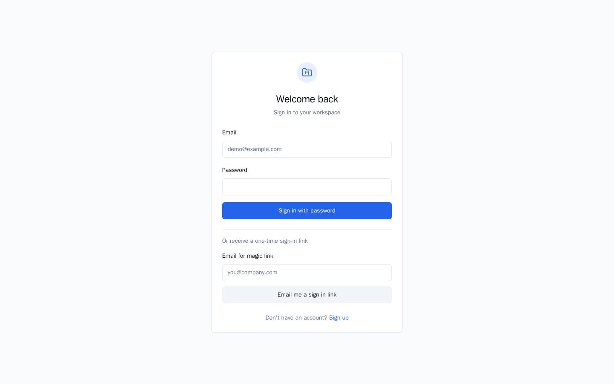

### Create a new workspace

Use **Sign up** at `/signup` to create a user account and a new tenant in one step. You become the **Owner** of that workspace.

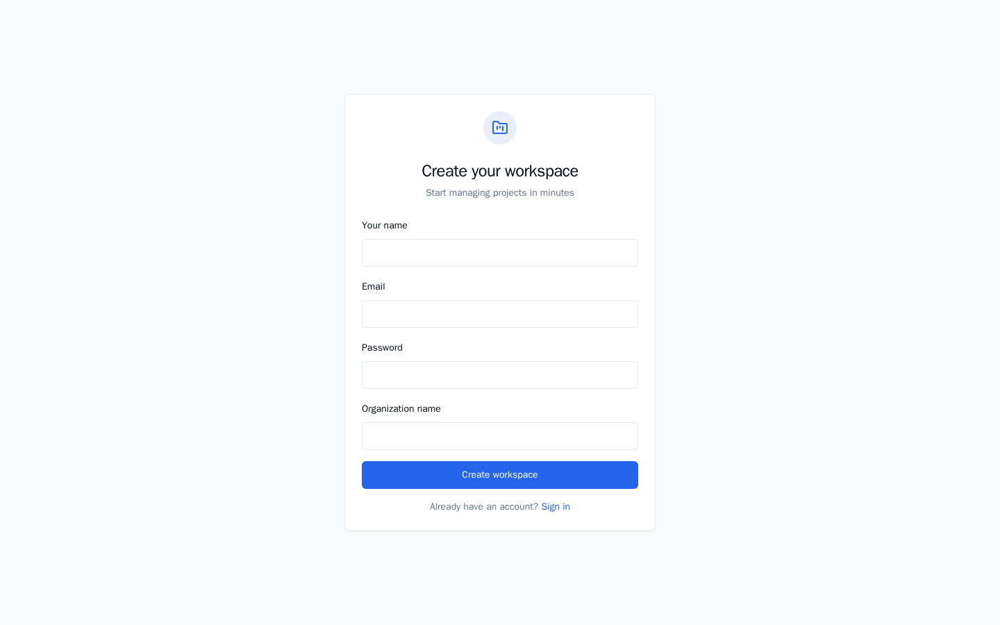

### Switch workspaces

After sign-in, use the **workspace switcher** at the bottom of the left sidebar to move between tenants you belong to. Switching updates your session and reloads all data for the selected workspace.

---

## 3. Dashboard

The dashboard is your home screen after login. It shows a customizable grid of widgets:

| Widget | Description |
|--------|-------------|
| **Project health** | Status breakdown of active projects |
| **CRM pipeline** | Opportunity counts by pipeline stage |
| **Upcoming milestones** | Next milestone dates across projects |
| **Workload** | Resource assignment summary |
| **Activity feed** | Recent CRM and project activity |
| **Quick actions** | Shortcuts to common tasks |

Drag and resize widgets to personalize the layout. Layout is saved per user per workspace.

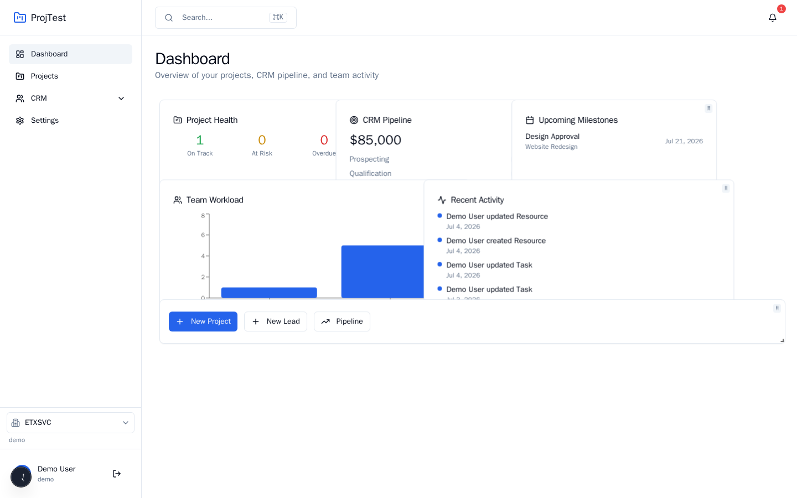

---

## 4. Projects and scheduling

### Project list

Open **Projects** in the sidebar to see all projects in the current workspace. Each card shows status, task count, due date, and linked CRM account.

Click **New project** to create a project. On the **Free** plan, workspaces are limited to **5 projects** (see Settings → Billing).

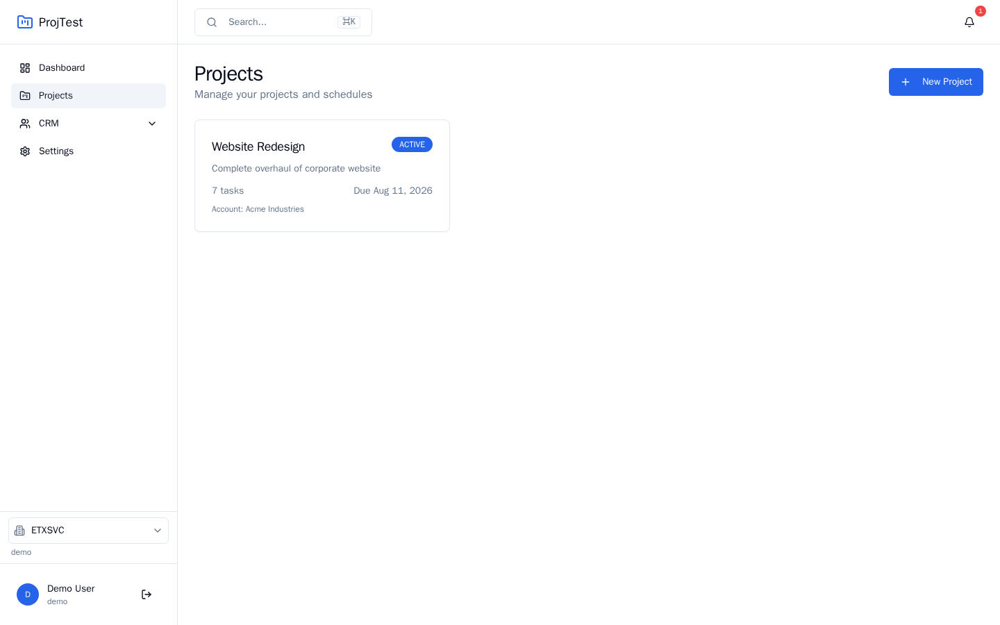

### Project overview

Click a project card to open its overview. Use the sub-navigation links for **Tasks**, **Gantt**, and **Resources**.

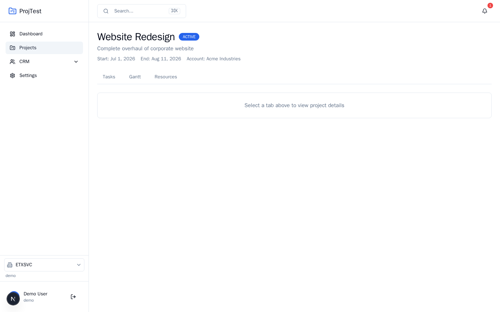

### Tasks (WBS)

The **Tasks** view lists the work breakdown structure:

- Create tasks with name, dates, progress, and type (Task, Milestone, Summary)
- Assign resources and track **critical path** badges
- Dependencies between tasks trigger automatic schedule recalculation

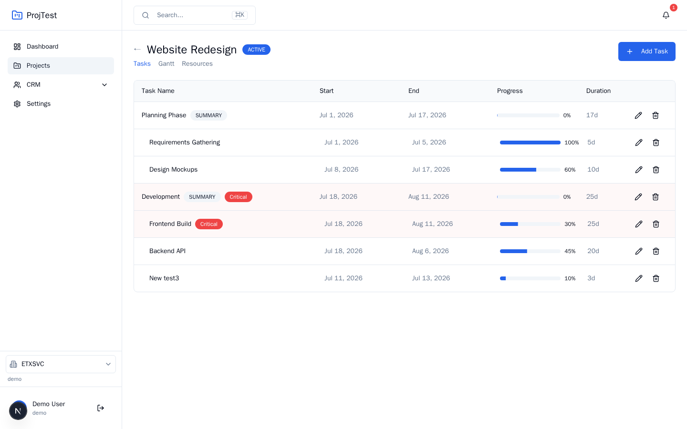

### Gantt chart

Open the **Gantt** tab from any project sub-page to view an interactive timeline:

- **Drag** task bars to change start/end dates
- **Zoom** between Day, Week, and Month views
- Toggle **critical path** highlighting
- Create, edit, and delete tasks inline

> The Gantt view uses the same scheduling engine as the task list. Changes in either view stay in sync.

### Resources

The **Resources** tab manages people, equipment, and materials assigned to the project, including capacity and cost rates.

### Project statuses

| Status | Meaning |
|--------|---------|
| PLANNING | Not yet started |
| ACTIVE | In progress |
| ON_HOLD | Paused |
| COMPLETED | Finished |
| CANCELLED | Abandoned |

---

## 5. CRM

### Accounts

**CRM → Accounts** lists customer organizations. Create accounts with industry, website, phone, and address. Link accounts to projects when creating or editing a project.

Free plan limit: **25 CRM accounts** per workspace.

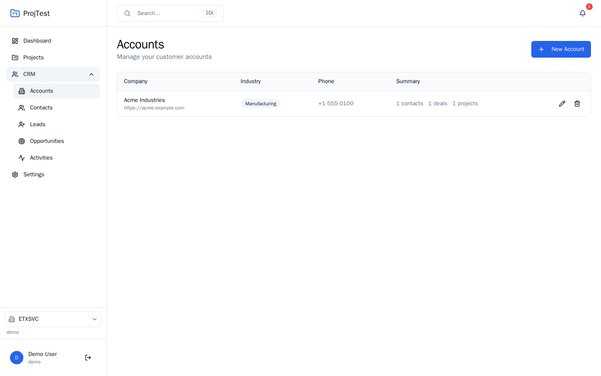

### Contacts, leads, and activities

| Section | Purpose |
|---------|---------|
| **Contacts** | People linked to accounts |
| **Leads** | Pre-qualification prospects with scores and status |
| **Activities** | Logged calls, emails, meetings, notes, and tasks |

On the **Leads** page, use **Qualify** or **Convert** to move leads through the funnel. Converting a lead creates an opportunity at the first pipeline stage.

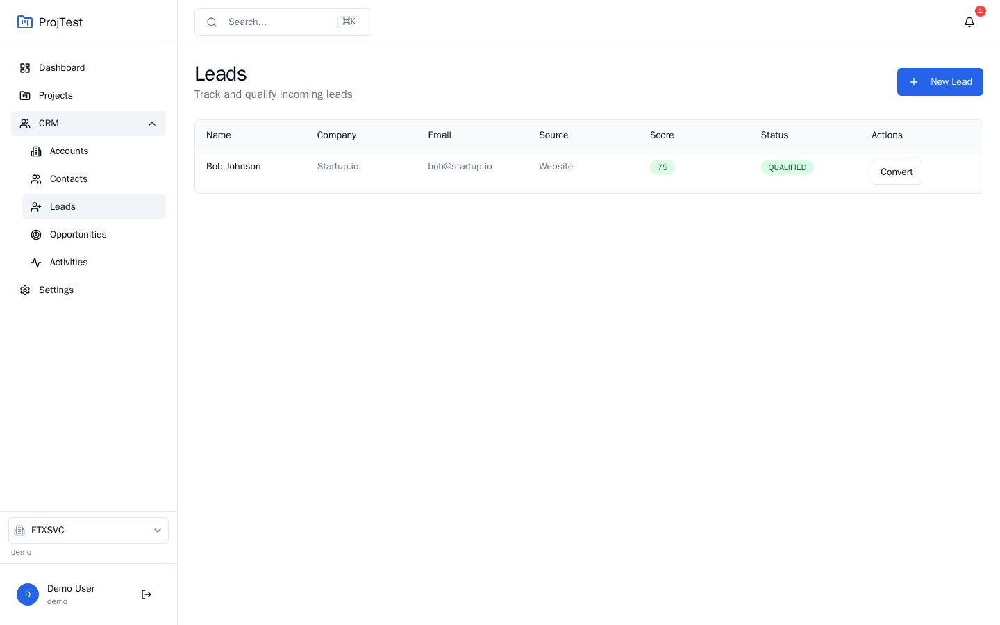

### Opportunities (pipeline)

**CRM → Opportunities** shows a **kanban board** of open deals. Drag cards between columns to change pipeline stage. Stages are configurable in Settings.

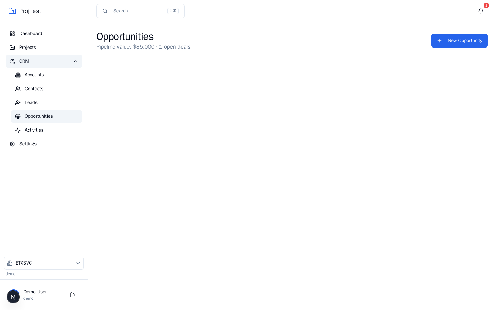

---

## 6. Settings and billing

Open **Settings** from the sidebar. **Owners** and **Admins** can edit; other roles see read-only values.

### Workspace

- Change workspace **name** and **logo URL**
- View slug, member count, and your role

### Pipeline stages

Add, rename, or remove CRM pipeline stages. Stages with open opportunities cannot be deleted.

### Project calendars

Define work calendars used for schedule calculations:

- Working days (Mon–Sun)
- Hours per day
- Holiday dates

### Billing

The billing panel shows your **plan**, **usage meters**, and subscription status:

| Plan | Projects | CRM accounts | Members |
|------|----------|--------------|---------|
| **Free** | 5 | 25 | 5 |
| **Pro** | Unlimited | Unlimited | Unlimited |

When Stripe is configured (`STRIPE_SECRET_KEY`, `STRIPE_PRICE_PRO`), Owners and Admins can **Upgrade to Pro** or **Manage subscription** via the Stripe customer portal.

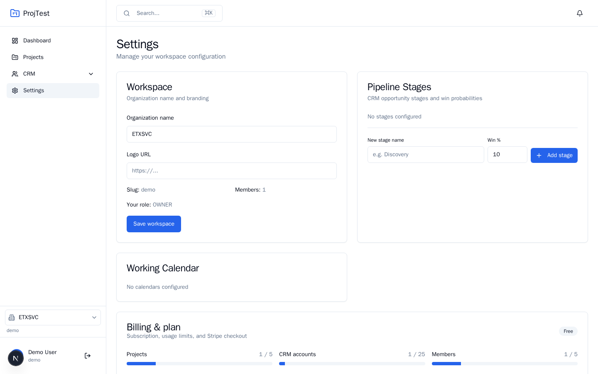

---

## 7. Search and keyboard shortcuts

### Global search (⌘K / Ctrl+K)

Click the search bar in the sidebar header or press **Ctrl+K** (Windows/Linux) / **⌘K** (Mac) to open the command palette. Search across projects, CRM accounts, contacts, and tasks, then jump directly to a result.

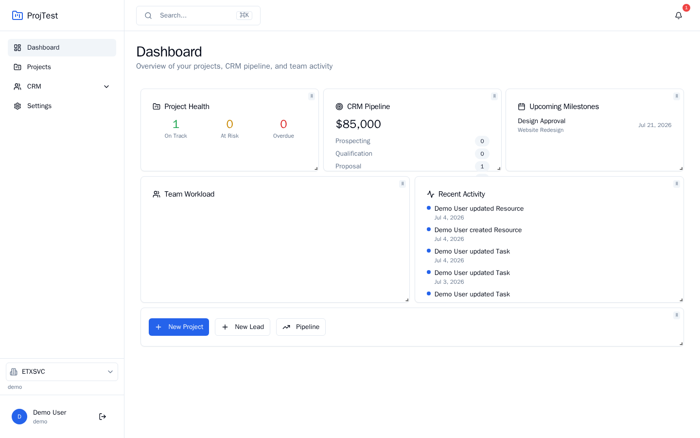

### Other shortcuts

| Action | How |
|--------|-----|
| Open search | `Ctrl+K` / `⌘K` |
| Navigate modules | Sidebar links |
| Switch workspace | Sidebar footer dropdown |

---

## 8. Roles and permissions

| Role | Settings & billing | Projects & CRM |
|------|-------------------|----------------|
| **Owner** | Full edit | Full access |
| **Admin** | Full edit | Full access |
| **Project Manager** | Read-only | Full access |
| **Member** | Read-only | Full access |
| **Sales** | Read-only | Full access |
| **Viewer** | Read-only | Full access |

Tenant data isolation is enforced at the database level (PostgreSQL Row Level Security). Users only see data belonging to the active workspace.

---

## 9. Demo data reference

After seeding, workspace **Demo Corporation** includes:

**CRM**

- Account: Acme Industries
- Contact: Jane Smith (VP Operations)
- Lead: Bob Johnson @ Startup.io (Qualified)
- Opportunity: Enterprise PM License — $85,000 (Proposal stage)
- Pipeline: Prospecting → Qualification → Proposal → Negotiation → Closed Won

**Project: Website Redesign** (Active)

- WBS tasks: Planning, Requirements, Design, Development phases
- Dependencies and a Design Approval milestone
- Resource: Alice Developer on Frontend Build

---

## 10. Troubleshooting

| Problem | Solution |
|---------|----------|
| App not loading | Run `docker compose --profile dev ps` and check logs: `make logs` |
| Login fails | Confirm seed ran; try `make seed` inside Docker |
| Magic link not received | Open Mailhog at http://localhost:8025 |
| Plan limit error | Upgrade to Pro in Settings, or delete unused records |
| Port confusion | Dev Docker maps **host 3001 → container 3000**; use `localhost:3001` |
| Regenerate manual screenshots | `docker compose --profile dev exec app ./node_modules/.bin/tsx scripts/capture-manual-screenshots.ts` |

For developers, see the main [README](../README.md) for architecture, testing, and CI details.

---

*Last updated: July 2026*
